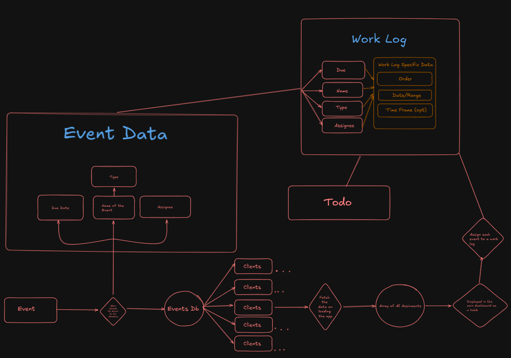

### ATANDT (codename)

A fully integrated app that helps students manage school work methodically.
Using SvelteKit, shadcn-svelte components, and tailwind for rapid development.
## Developing

### How data is connected in this app?



# How to add a new feature?
- Add a new page to `src/routes/` with the name of the page
- Add the new page to the `src/routes/index.js
install dependencies with `npm install` (or `pnpm install` or `yarn`), start a development server:

```bash
npm run dev

# or start the server and open the app in a new browser tab
npm run dev -- --open
```

## Building

To create a production version:

```bash
npm run build
```

You can preview the production build with `npm run preview`.

> To deploy your app, you may need to install an [adapter](https://kit.svelte.dev/docs/adapters) for your target environment.
